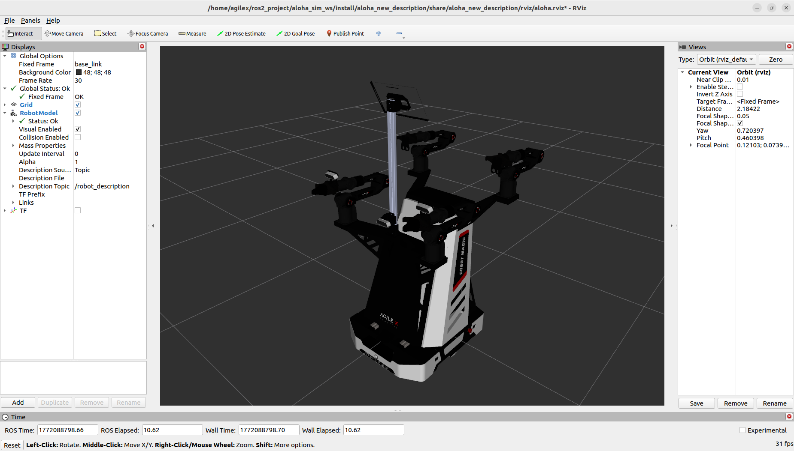

# Aloha URDF

## 注意：

**由于tracer2.dae文件太大，导致无法上传Github，所以压缩后上传，下载时需要解压**

## 开发环境

ubuntu 22.04 + ROS2 humble 

下载代码

```
mkdir -p agilex_ws/src
cd agilex_ws/src
git clone https://github.com/agilexrobotics/mobile_aloha_sim_ros2.git
cd ~/agilex_ws/src/mobile_aloha_sim_ros2/aloha_new_description/meshes
unzip tracer2.zip
cd ~/agilex_ws/src
colcon build 
```

查看URDF

```
cd ~/agilex_ws/
source install/setup.bash
ros2 launch aloha_new_description display_aloha_tracer2_dabai.launch.py 
```



